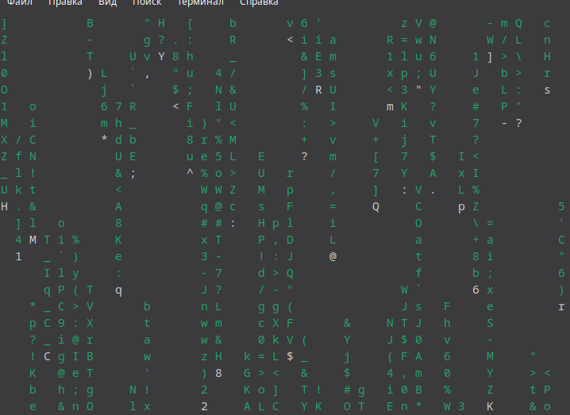

# Hi 👋, I'm k1rpit 

### 👋 About Me
- 👦 **Age:** 13 years old
- 🛡️ **Interests:** Deeply into **CyberSecurity** & Ethical Hacking
- 🐍 **Current Stack:** Active **Python** developer
- 🐧 **OS:** Running on **Debian Linux** as my main system
- 🎯 **Next Goal:** Transitioning to **C** for low-level programming

---

  

  

- Developing a cryptographic password generator that uses os.urandom, Base64 salting, and SHA-512/BLAKE2b hashing. [Sextillion-Pass-Gen](https://github.com/k1rpit/Sextillion-Pass-Gen)

- Studying Python and CyberSecurity through technical literature and hands-on coding. **Linux Sysadmin basics (Debian), Network Protocols (TCP/IP), Pentesting Automation|Self-learning via technical books, official documentation, and practical coding.**

- Developing an automated multi-threaded network scanner that generates random target IPs, detects open ports using Nmap, and fetches OS/geolocation data. [K1R-Scan-fantom](https://github.com/k1rpit/K1R-Scan-fantom)

- Developing Hasher-Core, an interactive CLI tool for cryptographic hashing (MD5, SHA-1, SHA-256, SHA-512) and randomized text salting. [Hasher-Core](https://github.com/k1rpit/Hasher-Core)

- 👨‍💻 All of my projects are available at [https://github.com/k1rpit?tab=repositories](https://github.com/k1rpit?tab=repositories)

- 📝 I regularly read articles on [Python, Linux, and CyberSecurity](Python, Linux, and CyberSecurity)

- 💬 Ask me about **Python scripting, Network scanning (Nmap), and Cryptographic hashing**

- 📫 How to reach me **t.me/k1rpit718s**

- 📄 Know about my experiences [t.me/k1rpit718s](t.me/k1rpit718s)

- ⚡ Fun fact **My computer only breathes Debian, everything else is bloatware.**

<h3 align="left">Connect with me:</h3>

<h3 align="left">Languages and Tools:</h3>

   

&nbsp;

